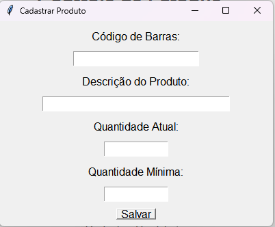
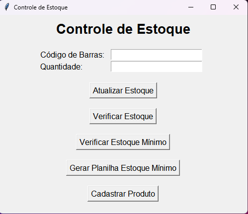

# Documentação do Código - Controle de Estoque

## Autores

- [@RaianSatyro](https://www.github.com/RaianSatyro)
- [@CaioSantos](https://github.com/CaioSantos-23)

## Introdução

Este código é um sistema simples de controle de estoque implementado em Python, utilizando a biblioteca **tkinter** para a interface gráfica e a biblioteca **pandas** para manipulação dos dados em uma planilha Excel. O objetivo é permitir que o usuário atualize o estoque de produtos, verifique os produtos abaixo do estoque mínimo e gere uma planilha com esses produtos.
## Arquivos do Projeto

O projeto contém os seguintes arquivos:

1 - **estoquepoo.py**: O arquivo principal que contém a implementação da interface gráfica e a interação com o usuário.

2 - **Estoque_com_codigo_de_barras.xlsx**: Arquivo de planilha Excel contendo os dados do estoque, incluindo o código de barras, o produto, a quantidade em estoque e a quantidade mínima.

3 - **setup.py**: Arquivo de configuração do cx_Freeze para criar o executável.
## Classes

A classe **Produto** representa um item no estoque e contém as seguintes propriedades:

**codigo_barras**: O código de barras do produto.

**produto**: A descrição do produto.

**quantidade_em_estoque**: A quantidade atual em estoque.

**quantidade_minima**: A quantidade mínima permitida em estoque.

**entrada_de_estoque**: A quantidade total de entrada no estoque.

**saida_de_estoque**: A quantidade total de saída do estoque.

A classe possui métodos para atualizar o estoque do produto (**atualizar_estoque**) e uma representação de string do objeto (**__str__**) para facilitar a exibição das informações do produto.

### Classe Estoque

A classe **Estoque** representa o controle geral de estoque e contém as seguintes propriedades:

**file_path**: O caminho do arquivo de planilha Excel que contém os dados do estoque.

**produtos**: Uma lista de objetos da classe **Produto** representando os produtos no estoque.

A classe possui métodos para carregar os dados do estoque a partir da planilha (**carregar_estoque**), salvar as alterações no estoque na planilha (**salvar_estoque**) e atualizar o estoque de um produto específico (**atualizar_produto**).

Também possui métodos para verificar produtos abaixo do estoque mínimo (**verificar_estoque**) e gerar uma planilha com esses produtos (**gerar_planilha_estoque_minimo**).

### Classe InterfaceUsuario
A **classe InterfaceUsuario** representa a interface gráfica para o usuário interagir com o controle de **estoque**. Ela contém um objeto da classe Estoque para realizar as operações de controle.

A interface possui campos para o usuário inserir o código de barras e a quantidade para atualizar o estoque de um produto, bem como botões para executar as funções de atualizar estoque, verificar estoque individual, verificar estoque mínimo e cadastrar um novo produto.

## Funcionalidades

- O programa lê os dados do estoque de um arquivo Excel e carrega-os em objetos da classe Produto.

- O usuário pode atualizar o estoque de um produto digitando o código de barras e a quantidade na interface.

- Quando o estoque de um produto é atualizado, a quantidade em estoque é ajustada e a entrada ou saída de estoque é registrada.

- O programa verifica se o estoque está abaixo do estoque mínimo e exibe uma mensagem caso esteja.

- O usuário pode verificar o estoque de um produto individualmente, digitando o código de barras e clicando no botão "Verificar Estoque".

- O usuário pode verificar todos os produtos abaixo do estoque mínimo clicando no botão "Verificar Estoque Mínimo". Se houver produtos abaixo do estoque mínimo, uma mensagem é exibida com a lista de produtos e suas quantidades em estoque.

- O usuário pode cadastrar um novo produto digitando o código de barras, a descrição do produto, a quantidade atual em estoque e a quantidade mínima na interface.

- O programa salva as alterações no estoque de volta no arquivo Excel quando o usuário atualiza o estoque ou cadastra um novo produto.

- O usuário pode gerar uma planilha separada contendo todos os produtos abaixo do estoque mínimo clicando no botão "Gerar Planilha Estoque Mínimo".
## Execução

Para executar o programa, basta rodar o arquivo "estoquepoo.py". A interface gráfica será exibida e o usuário poderá interagir com as funcionalidades de controle de estoque.
## Criação do Executável

Para criar o executável, execute o comando python **setup.py build** no terminal. O executável será gerado na pasta "build" dentro do projeto. Certifique-se de que o arquivo "Estoque_com_codigo_de_barras.xlsx" esteja na pasta "data" junto com o arquivo "estoquepoo.py".
## Observações

O programa foi desenvolvido com base no Python 3.5 e requer a instalação das bibliotecas **tkinter**, **pandas** e **cx_Freeze**.

Verifique se o arquivo "Estoque_com_codigo_de_barras.xlsx" contém os dados do estoque no formato correto e possui as colunas "Codigo_de_Barras", "Produto", "Quantidade_em_Estoque" e "Quantidade_Minima".

O programa não realiza validações extensivas dos dados inseridos pelo usuário, portanto, certifique-se de digitar informações corretas para evitar possíveis erros.
## Melhorias

- Corrigir erro de DLL que está ocorrendo.

- Autenticação de Usuário: Adicionar um sistema de login e autenticação de usuário para controlar o acesso ao sistema de controle de estoque.

- Validação de Dados: Implementar uma validação mais completa dos dados inseridos pelo usuário para garantir que as informações fornecidas sejam válidas e coerentes.

- Melhorias na Interface Gráfica: Aprimorar a interface gráfica para torná-la mais intuitiva, amigável e esteticamente agradável.

- Histórico de Movimentações: Adicionar a funcionalidade de rastrear e exibir o histórico de movimentações de cada produto, incluindo entradas e saídas de estoque, datas e responsáveis pelas alterações.

- Pesquisa e Filtros: Incluir opções de pesquisa e filtros para facilitar a localização de produtos específicos no estoque.

- Backup Automático: Implementar um sistema de backup automático dos dados do estoque para evitar perda de informações em caso de falhas.

- Gerenciamento de Fornecedores: Adicionar recursos para gerenciar informações de fornecedores, como contatos, preços, prazos de entrega, entre outros.

- Relatórios Personalizados: Permitir a criação de relatórios personalizados com base em diferentes critérios, como produtos mais vendidos, produtos com estoque abaixo do mínimo, entre outros.

- Multiusuário e Concorrência: Suportar o uso simultâneo por vários usuários, garantindo a consistência dos dados e evitando conflitos de alterações.

- Integração com Código de Barras: Integrar o sistema com um leitor de código de barras para facilitar a entrada e consulta de produtos no estoque.

- Internacionalização: Adicionar suporte para diferentes idiomas, tornando o sistema mais acessível para usuários de diferentes regiões.

## Screenshots

## Considerações Finais

Este código oferece uma solução simples para o controle de estoque com uma interface gráfica amigável para o usuário. É importante lembrar que esse é apenas um exemplo de implementação básica e pode ser expandido e aprimorado para atender a necessidades mais específicas em projetos de controle de estoque mais complexos.